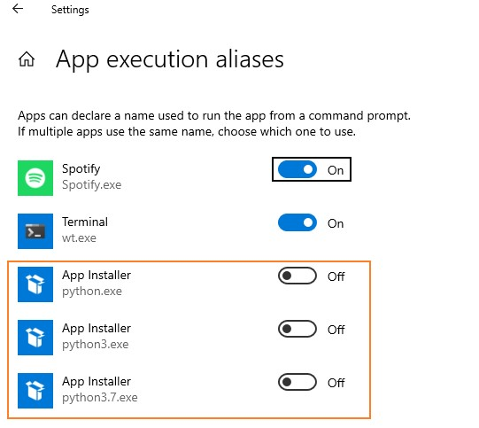

# priv-win10-config-setup
Windows 10 coding environment set up.

## Pre-requisites
- Create Win user without `spaces`
- Install Windows Terminal from MS Store
- Install SublimeText and let `.json` files to be openable by it
- Run commands from Windows Terminal with `run as administrator` (add privileges to `.exe` file)

## Steps
### 1. Loosen the windows installation execution policy 
> Set-ExecutionPolicy RemoteSigned

### 2. Install choco - software installation manager
> iwr -useb community.chocolatey.org/install.ps1 | iex

### 3. (Optional - install BCU - software to get rid of bulk crap from the system.)
> choco install bulk-crap-uninstaller

### 4. Install PowerShellCore and create PowerShell PROFILE file.
> choco install powershell-core
> ni -Force $PROFILE

### 4.1 Customize PowerShell with Oh My Posh
Visit: [Oh My Posh](https://ohmyposh.dev/)  
Install in PS by:
> Set-ExecutionPolicy Bypass -Scope Process -Force; Invoke-Expression ((New-Object System.Net.WebClient).DownloadString('https://ohmyposh.dev/install.ps1'))

Restart of terminal is suggested.  
Then to make Oh My Posh used as a default layout you need to update PS `$PROFILE` file.  
Add this line to the file:
> oh-my-posh init pwsh | Invoke-Expression 

You would need to install some [fonts](https://ohmyposh.dev/docs/installation/fonts) using:
> oh-my-posh font install

### 5. Update/customize PROFILE with necessary aliases (see file).
[My Current PowerShell Profile](data/Microsoft.PowerShell_profile.ps1)

### 6. Install and configure pyenv for windows.
> choco install pyenv-win -y  
> pyenv update  
> pyenv install --quiet `place.python.version.1` `place.python.version.n` 

You need to change app execution aliases for Python.
They must be disabled because the execution aliases and pyenv for Windows intercept the python command.

`Win` and search for App Execution Aliases:

Then you can set global python in terminal by:
> pyenv global `eg.3.10.7`

### 7. Install and configure git
> choco install git  
> refreshenv  
> git config --global user.name "Filip Wilczak"  
> git config --global user.email majinvlq@gmail.com  

Create ssh-key if necessary to authenticate connection with GitHub.
> ssh-keygen -C majinvlq@domain.com  
 
Preferred directory to save ssh keys are given by default in terminal.
> cat ~/.ssh/id_rsa.pub

Then add generated ssh key into your GitHub `https://github.com/settings/keys`

Test the connection in terminal by:
> ssh -T git@github.com

## And voila... python is configured in Windows 10!

### todo list:
- add [copy-text-to-clipboard](https://github.com/sindresorhus/copy-text-to-clipboard/blob/main/readme.md)